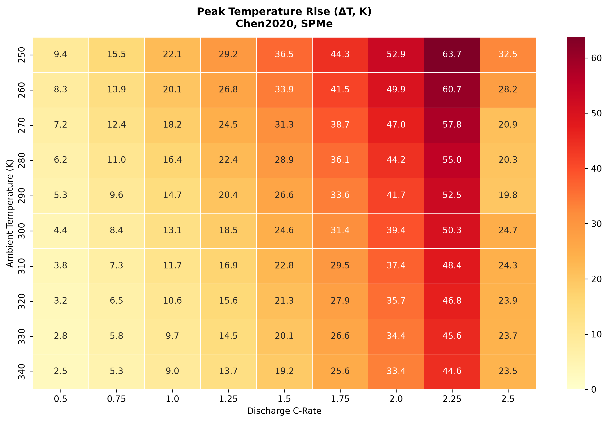
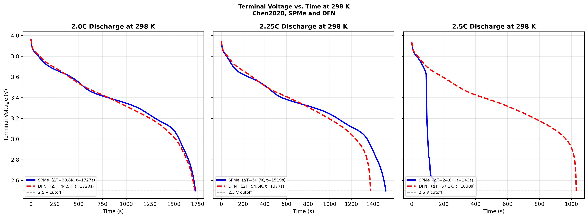

# battery-thermal-cliff

[](https://doi.org/10.5281/zenodo.21756397)


PyBaMM simulation framework for investigating transport-limited thermal behaviour in lithium-ion batteries and the emergence of a non-monotonic thermal response ("thermal cliff") under high-rate discharge.

---

## Overview

> **When More Current Means Less Heat: A Transport-Limited Thermal Response in Lithium-Ion Battery Simulations**

This repository accompanies the research paper investigating an unexpected thermal phenomenon in lithium-ion batteries using electrochemical simulations performed with PyBaMM.

Contrary to the common assumption that battery heating always increases with discharge current, simulations reveal that one parameterization exhibits a sharp reduction in peak temperature rise beyond a critical discharge rate. This **thermal cliff** arises from electrolyte transport limitations that terminate discharge long before theoretical capacity is reached.

The study further demonstrates that this behaviour depends strongly on both battery parameterization and electrochemical model fidelity.

A detailed paper describing the framework is available on Zenodo:

**https://doi.org/10.5281/zenodo.21756397**

<p align="center">
  
</p>

---

## Models Investigated

Three battery parameter sets are evaluated:

- **Chen2020** (NMC INR21700 M50)
- **Ecker2015** (NMC pouch cell)
- **Prada2013** (LFP/graphite)

Two electrochemical models are compared:

- **SPMe** (Single Particle Model with Electrolyte)
- **DFN** (Doyle–Fuller–Newman)

---

## Features

The Python implementation reproduces the complete analysis presented in the accompanying paper.

It performs

- battery simulation using PyBaMM
- parameter loading and preprocessing
- ambient temperature sweeps
- discharge C-rate sweeps
- peak temperature rise (ΔT) analysis
- discharge duration analysis
- terminal voltage analysis
- electrolyte concentration analysis
- Bruggeman coefficient sensitivity analysis
- SPMe–DFN model comparison
- publication-quality figure generation

Every figure appearing in the paper is generated automatically.

---

## Repository Structure

```text
battery-thermal-cliff/
│
├── battery_safe_operating_envelope.py
├── README.md
├── LICENSE
├── requirements.txt
│
└──images/
    ├── figure1_chen_delta_T.png
    ├── figure2_chen_duration.png
    ├── figure3_chen_voltage_cutoff.png
    ├── figure4_chen_conc.png
    ├── figure5_ecker_delta_T.png
    ├── figure6_ecker_duration.png
    ├── figure7_ecker_voltage_cutoff.png
    ├── figure8_sensitivity_bruggeman.png
    ├── figure9_dfn_vs_spme.png
    ├── figure10_prada_delta_T.png
    ├── figure11_prada_duration.png
    ├── figure12_prada_voltage_cutoff.png
    ├── figure13_prada_conc.png
    ├── figure14_prada_extended_sweep.png
    ├── figure15_cutoff_c0_sensitivity.png
    ├── figure16_transport_param_sensitivity.png
    ├── figure17_bruggeman_wide_sensitivity.png
    ├── figure18_heat_decomposition.png
    ├── figure19_capacity_normalized_heat.png
    └── figure20_ocp_swap_counterfactual.png
```

---

## Requirements

Python **3.10+**

Required packages:

```text
pybamm
numpy
matplotlib
seaborn
scipy
casadi
```
---

## Setup

```bash
python3 -m venv venv
source venv/bin/activate   # on Windows: venv\Scripts\activate
pip install -r requirements.txt
```

---

## Usage

Run the full pipeline (headless, saves everything to `./figures`):

```bash
python README.md.py
```

Other options:

```bash
python battery_safe_operating_envelope.py --show               # also display each figure as it renders
python battery_safe_operating_envelope.py --quick               # coarse grids, for a fast end-to-end smoke test
python battery_safe_operating_envelope.py --skip-extensions      # only figures 1-14 (skip 15-20 + diagnostics)
python battery_safe_operating_envelope.py --output-dir results   # choose the output directory
```

A full run (`AMBIENT_TEMPS x C_RATES` grids for three parameter sets, plus
all sensitivity sweeps) involves several hundred PyBaMM solves and can take
some time; use `--quick` first to confirm your environment is set up
correctly.

---

## Output

- `figures/figure1_....png` ... `figures/figure20_....png` — all paper
  figures, at 300 DPI.
- `figures/run_log.txt` — full console log of the run, including the
  DFN mesh-refinement convergence check and Biot number estimates
  reported in the paper's Methods/Limitations discussion.

---

## Structure

- `load_parameter_values()` — loads a PyBaMM parameter set, patching
  Prada2013's missing thermal/geometric keys (see the paper's Methods
  section for the full derivation).
- `simulate()` / `run_discharge()` / `run_sweep()` — shared simulation
  helpers used by every figure.
- `generate_main_figures()` — Figures 1-14.
- `generate_extension_figures()` — Figures 15-20 plus the DFN convergence
  and Biot number diagnostics.

---

## Generated Figures

Running the script generates the following publication figures:

- Figure 1 — Chen2020 Peak Temperature Rise (ΔT)
- Figure 2 — Chen2020 Discharge Duration
- Figure 3 — Chen2020 Voltage Profiles
- Figure 4 — Chen2020 Electrolyte Concentration
- Figure 5 — Ecker2015 Peak Temperature Rise (ΔT)
- Figure 6 — Ecker2015 Discharge Duration
- Figure 7 — Ecker2015 Voltage Profiles
- Figure 8 — Chen2020 Bruggeman Coefficient Sensitivity Analysis
- Figure 9 — Chen2020 SPMe vs DFN Comparison
- Figure 10 — Prada2013 Peak Temperature Rise (ΔT)
- Figure 11 — Prada2013 Discharge Duration
- Figure 12 — Prada2013 Voltage Profiles
- Figure 13 — Prada2013 Electrolyte Concentration
- Figure 14 — Prada2013 Extended High-C-Rate Sweep
- Figure 15 — Chen2020 Cutoff Voltage & Initial Electrolyte Concentration Sensitivity
- Figure 16 — Chen2020 Additional Transport-Parameter Sensitivity
- Figure 17 — Chen2020 Bruggeman Coefficient Sensitivity, Widened Range
- Figure 18 — Chen2020 SPMe vs. DFN Heat Source Decomposition
- Figure 19 — Chen2020 vs. Ecker2015 Capacity-Normalized Peak Heat Generation 
- Figure 20 — Chen2020 vs. Prada2013 OCP-Swap Counterfactual

<p align="center">
  
</p>

---

## Principal Findings

This study demonstrates that

- the SPMe predicts a transport-limited thermal cliff for the Chen2020 NMC parameter set, where peak temperature rise decreases beyond a critical discharge rate due to early voltage cutoff
- the thermal cliff is associated with near-complete electrolyte depletion at the positive-electrode current collector
- the Ecker2015 NMC parameter set does not exhibit a thermal cliff, indicating that the behaviour depends on cell design rather than NMC chemistry alone
- the Prada2013 LFP parameter set shows no thermal cliff up to 4.0C because its electrolyte remains well supplied with lithium ions
- comparison with the DFN model shows that the predicted thermal cliff is highly sensitive to electrochemical model fidelity
- transport-limited thermal predictions from reduced-order models should not be treated as a universal property of a battery chemistry or generalized from a single simulation

---

## Results

The simulations show that

- the Chen2020 NMC parameter set exhibits a transport-limited thermal cliff between 2.25C and 2.5C, where peak temperature rise decreases despite increasing discharge rate
- the thermal cliff is accompanied by a collapse in discharge duration due to early voltage cutoff caused by electrolyte depletion
- the Ecker2015 NMC parameter set shows no thermal cliff across the same operating conditions
- the Prada2013 LFP parameter set shows no thermal cliff up to 4.0C, with peak temperature rise increasing smoothly with discharge rate
- the location of the thermal cliff in Chen2020 shifts with changes to the positive-electrode Bruggeman coefficient
- comparison with the DFN model shows that the thermal cliff predicted by the SPMe is highly dependent on electrochemical model fidelity

---

## Scientific Contributions

This work

- investigates transport-limited thermal behaviour in lithium-ion battery simulations across temperature and discharge-rate operating conditions
- explains the mechanism responsible for the transport-limited thermal cliff using electrolyte concentration and voltage analysis
- evaluates the robustness of the thermal cliff across multiple battery parameter sets and electrochemical models
- examines the sensitivity of the thermal cliff to changes in electrolyte transport properties through Bruggeman coefficient analysis
- discusses the implications of transport-limited thermal predictions for battery management system (BMS) design and safe operating envelopes

---

## License

This project is released under the **GNU General Public License v3.0**.

---

## Citation

If you use this software in your research, please cite both the software repository and the accompanying publication.

**Software**

```text
Ratnam, A. R. (2026).

battery-thermal-cliff (Version 1.0.0) [Computer software].

GitHub.
```

**Publication**

```text
Ratnam, A. R. (2026).

When More Current Means Less Heat:
A Transport-Limited Thermal Response in Lithium-Ion Battery Simulations.

Zenodo.

https://doi.org/10.5281/zenodo.XXXXXXX
```
